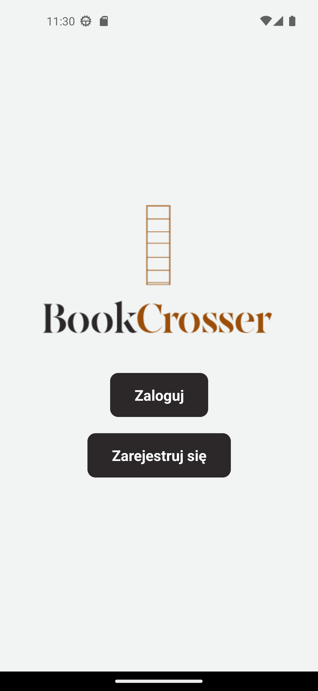
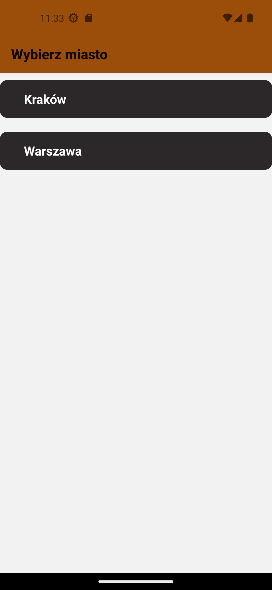
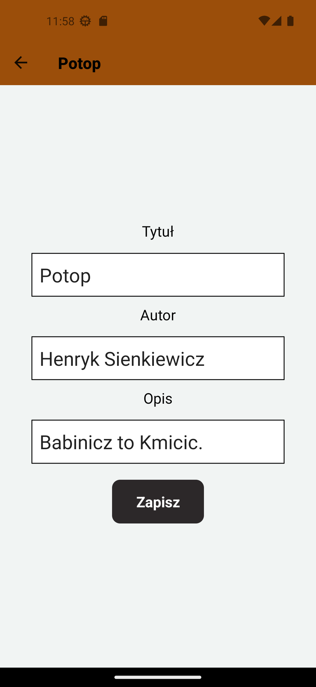
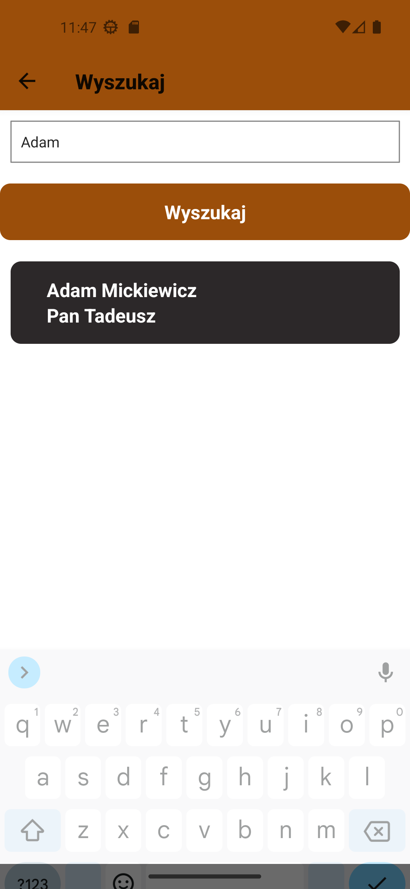
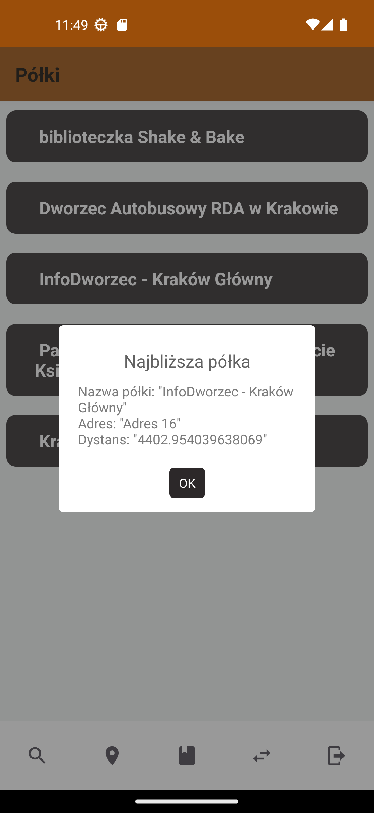
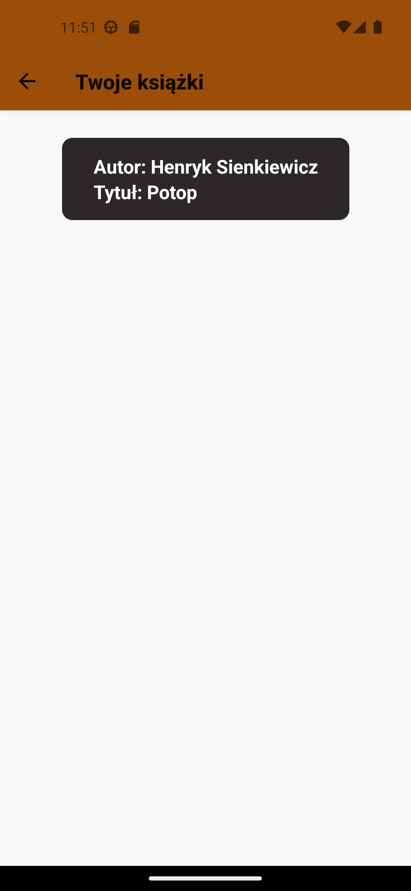

#BookCrosser

> An application supporting and facilitating the use of shelves and books available in the BookCrossing service.

## Table of contents

* [General Information](#general-information)
* [Technologies Used](#technologies-used)
* [Features](#features)
* [Screenshots](#screenshots)
* [Project Status](#project-status)

## General Information
> **_NOTE:_** This application was developed as a part of my engineering thesis.

BookCrosser consists of three main components:

- PostgreSQL Database
- Server application built in Django
- Client mobile application created using React Native

## Technologies Used
- Python
- Django
- JavaScript
- React Native
- PostgreSQL
- Docker

  
## Features
- Selecting a city to browse books and shelves.
- Browsing the list of shelves profiles in a particular city.
- Browsing the list of books profiles on a selected shelf.
- Locating the shelf nearest to the user at any given moment.
- Creating and editing detailed books profiles.
- Taking books profiles from the shelves.
- Checking the history of read books.
- Searching for books in a specific city.
- Managing the application using the built-in Django administrative panel.

## Screenshots

    
    
    
    
    
    
    
    
    

 

## Project Status

The project is **complete** with a room for improvements.
